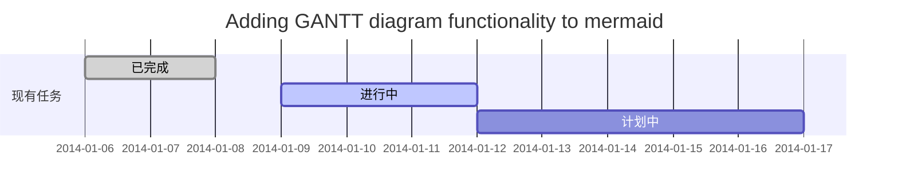

# hello world

## hello world

### hello world

#### hello world

##### hello world

###### hello world

# *hello*

# **hello**

# ***hello***

> 这是引用的内容

****


[百度](http://baidu.com)

```html
<a href="https://www.jianshu.com/u/1f5ac0cf6a8b" target="_blank">简书</a>
```

* jjjjj
* eee

1.helo

2.hehe

3.jjjj


| 姓名 | 技能 | 排行 |
| :--- | :--- | ---- |
| 刘备 | 哭   | 大哥 |
| 关羽 | 打   | 二哥 |
| 张飞 | 骂   | 三第 |

`cout<<helo`

```go
func main() {

​	fmt.Println("hello world")

}
```

```flow
st=>start: 开始
op=>operation: My Operation
cond=>condition: Yes or No?
e=>end
st->op->cond
cond(yes)->e
cond(no)->op
```


```flow
st=>start: 注册
op1=>operation: 登录
op2=>operation: 购买
cond=>condition: 是否已购买？
e=>end
st->op1->cond
cond(yes)->e
cond(no)->op2->e
```


```flow
st=>start: 开始
op=>operation: My Operation
op1=>operation: 对对对
cond=>condition: Yes or No?
e=>end
st->op->cond
cond(yes)->e
cond(no)->op1->op
```

```sequence
participant 客户端
participant 控制器
participant 业务
participant 数据库

客户端->控制器: 提交数据店铺
Note right of 客户端: 提交数据javascript进行验证
控制器->控制器: 验证数据完整性
Note left of 控制器: 返回错误的字段信息
控制器-->客户端: 数据不完整
控制器->业务: 保存店铺到数据库
业务->业务: save店铺数据
业务-->控制器: 保存出现异常
控制器-->客户端: save异常，提示客户端
业务->数据库: 保存成功
数据库-->业务: success
业务-->控制器: success
控制器-->客户端: success 客户端
Note left of 控制器: 返回正常的提示，并跳转到审核第二部
```

```
- 代表实线 ， 主动发送消息，比如 request请求
> 代表实心箭头 ， 同步消息.
-- 代表虚线，表示返回消息，spring Controller return
>> 代表非实心箭头 ，异步消息，比如AJAX请求
```





